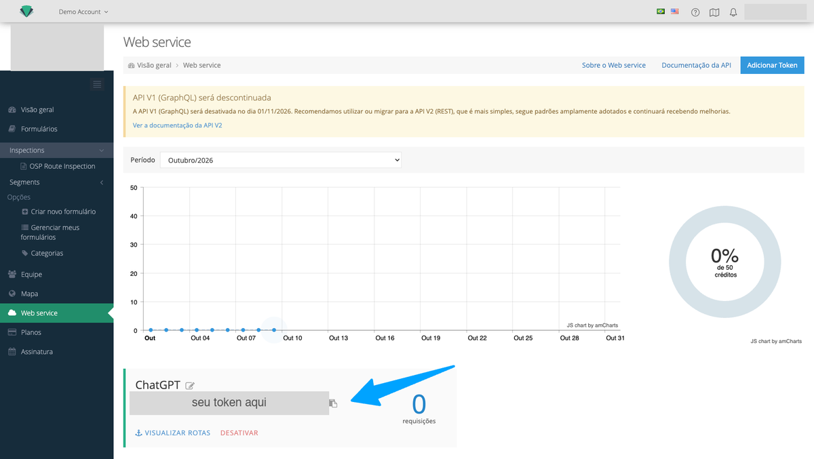
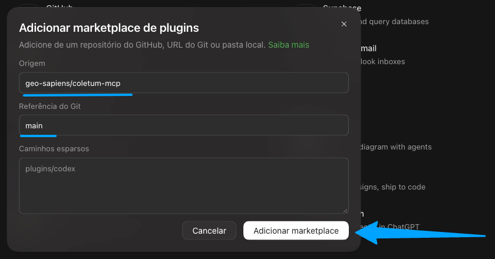
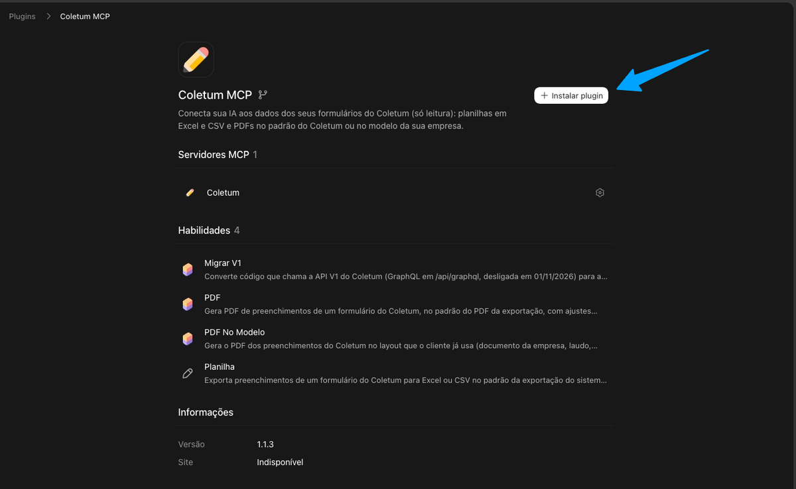
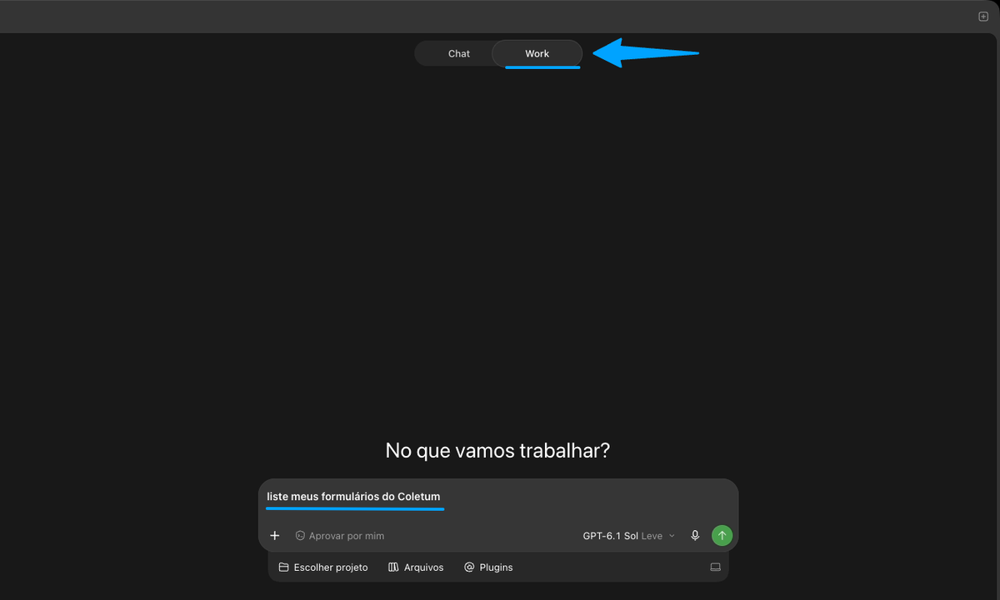
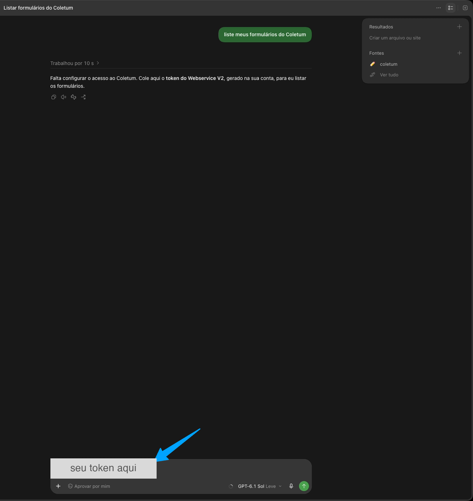

# Coletum MCP no ChatGPT

Guia para usar o Coletum MCP no app do ChatGPT: você pede em português e recebe planilha ou PDF dos seus formulários do
Coletum. O conector **só lê** os dados, nunca altera nada no Coletum. Não precisa instalar nada além do app.

## O que você precisa

- O **app do ChatGPT** para Windows ou Mac, num plano com acesso a plugins.
- Uma conta de **administrador no Coletum**, para gerar o token.

## 1. Gere o token no Coletum

1. Entre no Coletum com uma conta de administrador.
2. Vá em **Menu principal > Web Service**.
3. Clique em **Adicionar Token** (ou **Criar meu primeiro token**, se for o primeiro), dê um nome (por exemplo,
   "IA") e salve.
4. Copie o token e guarde por alguns minutos. Ele não aparece de novo.

## 2. Adicione o marketplace

1. Abra o app do ChatGPT.
2. Abra **Plugins**, clique em **Adicionar** e depois em **Adicionar marketplace** (no app em inglês: Plugins > Add > Add a
   marketplace).
3. Em **Origem**, informe `geo-sapiens/coletum-mcp` e, em **Referência do Git**, `main`. Clique em
   **Adicionar marketplace**.

## 3. Instale o plugin

1. Na aba **Pessoais** da lista de plugins, abra o **Coletum MCP**.
2. Clique em **Instalar plugin**.

## 4. Feche e abra o app de novo

1. Feche o ChatGPT **por completo**. No Windows, além de fechar a janela, clique com o botão direito no ícone do ChatGPT
   perto do relógio e saia por ali. No Mac, com o app em primeiro plano, aperte Cmd+Q.
2. Abra o app de novo.

> 📷 Print: ícone do ChatGPT perto do relógio do Windows, com a opção de sair (salvar como docs/img/chatgpt-04-sair-windows.png)

## 5. Primeira conversa

1. Abra uma **conversa nova** no **Work** (ou no Codex, se você usa) e peça: **"liste meus formulários do Coletum"**.
   No **Chat** o conector pode não aparecer.

   

2. O conector pede o token. **Cole o token** gerado no passo 1 na conversa.
3. Ele testa o token e guarda no cofre de senhas do computador. Nas próximas conversas não pede mais. Se você também usa
   o Claude neste computador, ele aproveita o mesmo token.
4. Aparece a lista dos seus formulários.

**A primeira vez demora alguns minutos:** o conector baixa o que precisa para rodar. Espere sem fechar o app. Das
próximas vezes é rápido.

> 📷 Print: lista de formulários na conversa (salvar como docs/img/chatgpt-06-formularios.png)

## 6. Use

Peça em português, por exemplo:

- "Exporta para Excel os preenchimentos desta semana do formulário NOME DO FORMULÁRIO"
- "Só os campos X e Y", "tudo numa aba só", "em CSV", "dos últimos 7 dias"
- "Gera o PDF dos 3 mais recentes", "põe meu logo e tira o campo Observações", "relatório fotográfico"
- "Gera o PDF neste modelo", junto com o documento que a sua empresa já usa

Os arquivos ficam na pasta `Documentos/Coletum`, e o ChatGPT mostra o caminho completo de cada um. Para abrir, peça
"abre o arquivo".

> 📷 Print: conversa com uma planilha ou PDF gerado e o caminho do arquivo (salvar como docs/img/chatgpt-07-arquivo-gerado.png)

## Se não funcionar

- **O ChatGPT diz que as ferramentas do Coletum não estão disponíveis:** confira se a conversa está no **Work** (ou no
  Codex), não no **Chat**.
- **O ChatGPT não acha o Coletum:** feche o app por completo (passo 4) e abra de novo.
- **Confira se o plugin está instalado e ativo:** em **Plugins**, abra o **Coletum MCP**. O conector aparece em
  **Servidores MCP** e os roteiros em **Habilidades**.
- **Trocar o token** (por exemplo, depois de gerar outro no Coletum): peça **"configure meu token do Coletum"** e cole
  o novo.
- Se ainda assim não funcionar, fale com o suporte do Coletum, com um print da resposta do ChatGPT.

> 📷 Print: página do plugin instalado, mostrando Servidores MCP e Habilidades (salvar como docs/img/chatgpt-08-plugin-ativo.png)
